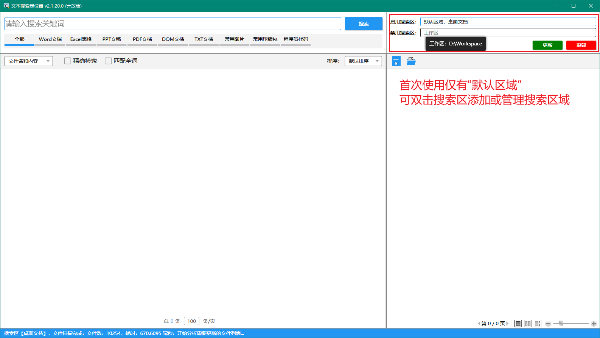
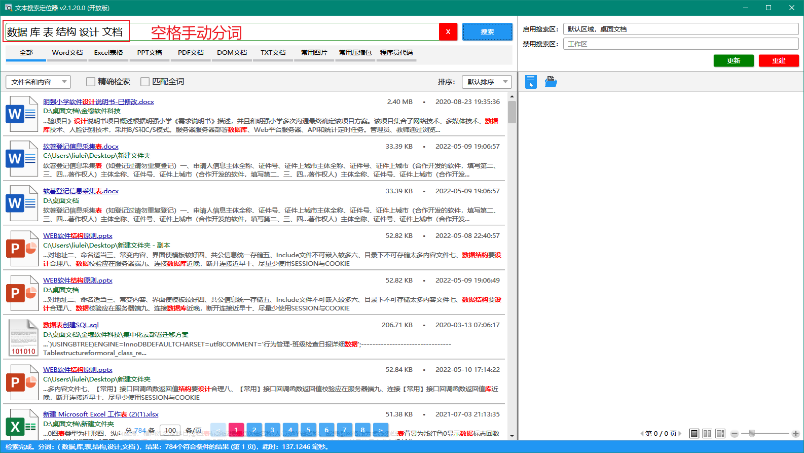
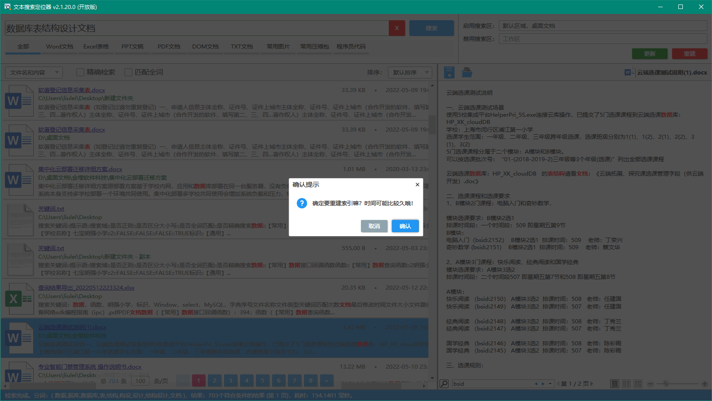

# 本地文本搜索定位器

#### 软件介绍
基于.net实现的本地文档的全文索引定位器，根据关键词搜索定位本地文档内容。便于查找历史文档时节省时间，本地文本搜索神器！

#### 软件架构
本地单机软件。
* WPF实现的UI（RubyerUI组件）
* Lucene.Net实现的索引（Jieba.NET分词器）
* NPOI、Spire、Microsoft.Office实现的文档内容读取

#### 安装教程
* 运行环境基于.net freamwork 4.6（需要安装此环境才能运行，win10+默认有此环境）
* 发布版下载解压可用

#### 使用说明
1. 双击文件夹设置自己需要搜索的文件夹
2. 点击“重建”按钮创建文档索引，更新文档索引点击“优化”按钮。
3. 索引创建结束后，搜索框输入关键词后，回车或者点击搜索按钮。搜索结果列表会显示搜索结果列表
4. 点击文档，右侧预览框会显示文档内容
5. 使用细节说明：
- 自动分词：数据库表结构 -> 数据库表结构,数据,库表,结构（勾选匹配全词后不分词）
- 手动分词：数据库 表 结构 -> 数据库,表,结构（空格作为分隔符）
- 文件类型：筛选不同类型的文件
- 仅文件名：关键词不匹配内容和路径，只匹配文件名
- 排序规则：默认排序、时间（远|近）、文件（大|小）
- 列表分页：仅有一页时不显示分页标签，有多页时显示分页标签
- 内容预览：右侧内容预览区可以复制、剪切（剪切只是从预览区剪切不影响源文件）

#### 依赖组件
1. [Rubyer](https://gitee.com/wuyanxin1028/rubyer-wpf)
2. [Lucene.Net](http://lucenenet.apache.org)
3. [Jieba.NET](https://github.com/anderscui/jieba.NET)
4. [NPOI](https://github.com/nissl-lab/npoi)
5. [Spire.Office](https://www.e-iceblue.com/Introduce/spire-office-for-net.html)
6. [Microsoft.Office.Interop.Excel](https://www.nuget.org/packages/Microsoft.Office.Interop.Excel/)
7. [Microsoft.Office.Interop.Word](https://www.nuget.org/packages/Microsoft.Office.Interop.Word/)
8. [Microsoft.Office.Interop.PowerPoint](https://www.nuget.org/packages/Microsoft.Office.Interop.PowerPoint/)
